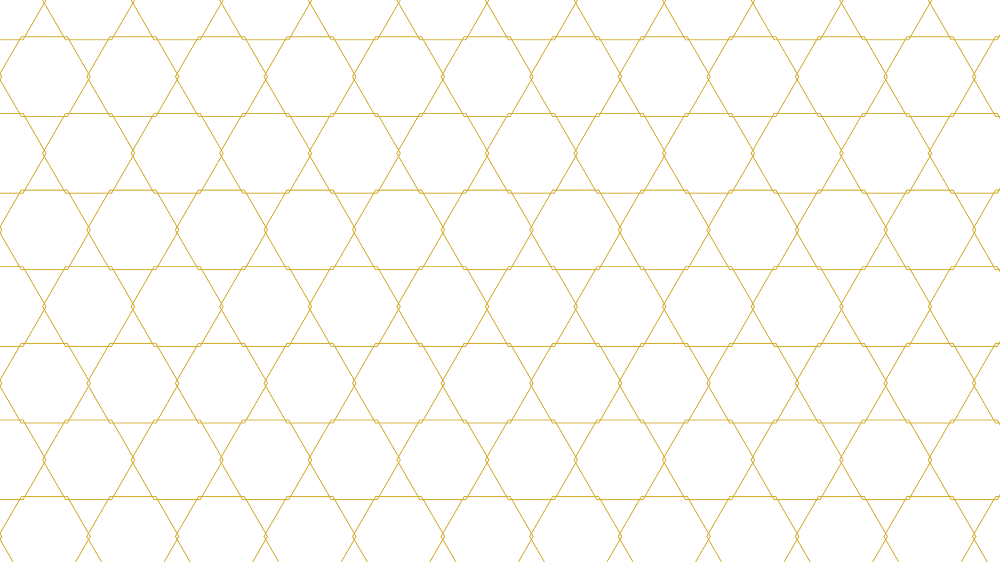

# svg-gen 🎨

X（旧Twitter）投稿用の幾何学模様SVGを自動生成するPythonスクリプトです。
白背景 × ゴールドラインスタイルをベースに、AIと一緒に作りました。

2つのモードがあります。

- **テンプレートモード**：形状・色・密度などをCLI引数で自分で指定
- **AIモード**：テーマ（例:「秋の夕暮れ」）を伝えると、Claude Sonnet 5が形状・色・密度・回転・レイヤー構成を考えて生成

## 対応図形

| オプション | 模様 |
|-----------|------|
| hexagon   | 六角形タイリング |
| circle    | 同心円グリッド |
| triangle  | 三角形タイリング |
| grid      | 格子模様 |
| star      | 六芒星タイリング |

## カラープリセット

`gold` / `lightgold` / `deepgold` / `silver` / `white` / `rose`

（AIモードでは上記に加えて `#RRGGBB` の任意カラーもClaudeが提案します）

## 使い方（テンプレートモード）

```bash
# デフォルト（六角形・ゴールド）
python svg_gen.py

# オプション指定
python svg_gen.py --shape star --density 6 --color rose --rotate 30
```

## 使い方（AIモード）

Claude API（Sonnet 5）が、与えたテーマから形状・色・密度・回転・不透明度を考え、
必要に応じて2種類の模様を重ねたデザインを組み立てます。

```bash
# APIキーを環境変数にセット（BYOK）
export ANTHROPIC_API_KEY=sk-ant-...

# テーマを伝えて生成
python svg_gen.py --ai --prompt "秋の夕暮れ、温かみのあるゴールド"
python svg_gen.py --ai --prompt "静謐な冬の朝、シルバーと白の対比" --output winter.svg

# モデルを明示指定したい場合（デフォルトは claude-sonnet-5）
python svg_gen.py --ai --prompt "祝祭感のある華やかな模様" --model claude-sonnet-5
```

実行すると、Claudeが考えたコンセプトと各レイヤーの仕様（形状・色・密度・回転・不透明度）が
ターミナルに表示され、そのままSVGとして出力されます。

### AIモードの仕組み

- 生成そのもの（座標計算）はテンプレートモードと同じ数学的ロジック（`hexagon`/`circle`/`triangle`/`grid`/`star`）
- Claudeが担うのは「どの形状を」「どんな色で」「どれくらいの密度・回転で」「何層重ねるか」という**デザイン判断**の部分
- 追加の依存ライブラリは不要（`urllib`など標準ライブラリのみでAnthropic APIを呼び出し）

## 動作環境

- Python 3.x（標準ライブラリのみ、AIモードも追加依存なし）
- Termux（Android）で動作確認済み
- AIモード利用には `ANTHROPIC_API_KEY` の設定とネットワーク接続が必要

## サンプル画像



## 作者

[@tomu_ai_dev](https://x.com/tomu_ai_dev)  
AIと協働するフリーランスAIエンジニアを目指して独学中。
